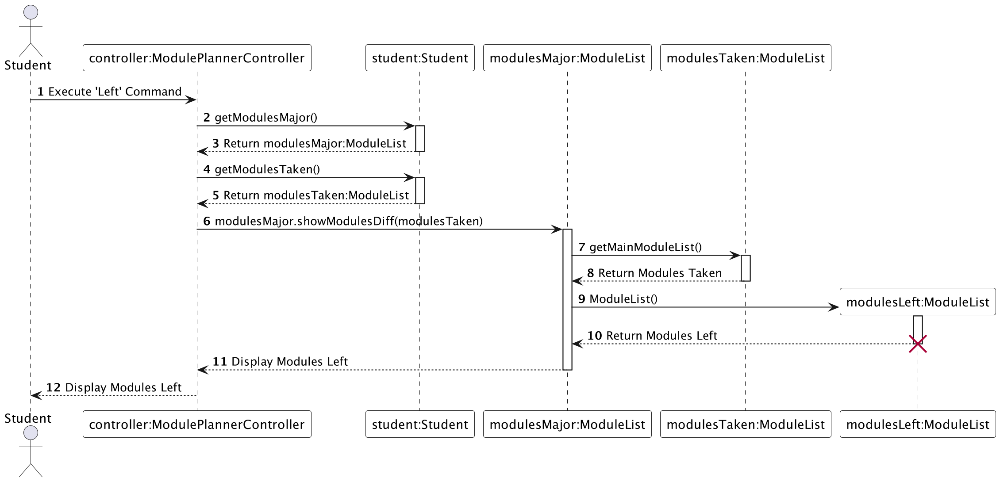
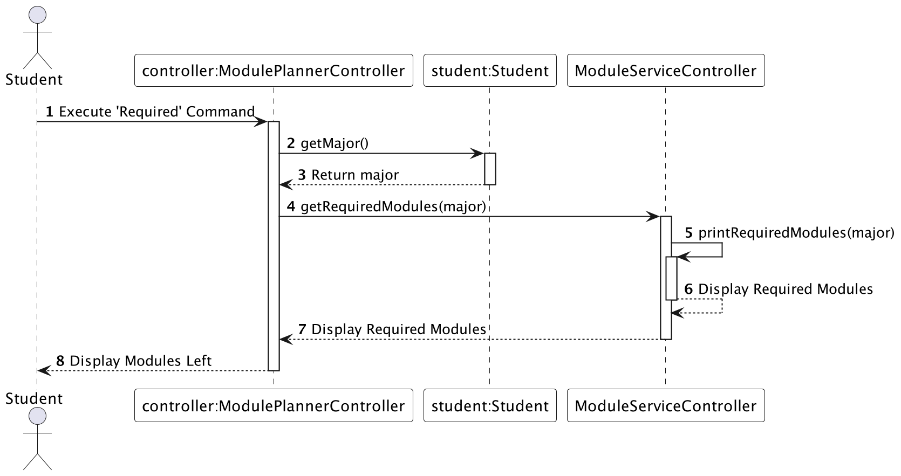

<h1 style="text-align: center; 
background-image: linear-gradient(to right, #370505, #5b2829, #814c4c, #a97171, #d19999);">
    
</h1>

<h1>
Developer Guide
</h1>
## Acknowledgements

{list here sources of all reused/adapted ideas, code, documentation, and third-party libraries -- include links to the original source as well}

## Design & implementation, Architecture

The Architecture Diagram given above explains the high-level design of the application.

The main logic of the application is handled by these four components
- **Controller**: 
  - Handles Commands coming from the User 
  - Combines data from the **Model** and UI Components from **View**
  - Never handles data logic
- **View**:
  - Responsible for printing onto the Command Line Application
- **Model**: 
  - Response for retrieving data from the **Data Repository** 
  - Performs REST API calls to the NUSMODS API
- **Storage**:
  - can save both schedule data and user data in .txt format, and read them back into corresponding objects.
  - depends on some classes in the Model component

### How the architecture components interact with each other

The Sequence Diagram above shows how the components interact with each other when the user inserts a module 
into his schedule

### View Component
The component is specified in Ui.java

The `UI` component:

- displays messages to the user by printing to the CLI
- displays results from commands executed by the ModulePlannerController class

### Logic Component

The `Logic` component:

1. Input from the user is received through `Ui` class, is the pass into `ModulePlannerController`.
2. When `ModulePlannerController` is called upon to execute a command, it uses the `Parser` class to parse for 
`UserCommand`.
2. This results in a `UserCommand` object which is executed by the `ModulePlannerController`.
3. The `UserCommand` calls the methods specific to each `UserCommand` from `ModuleMethodsController`.
(`ModuleServiceController` contains helper functions for `ModuleMethodsController`) 
4. The result of the command execution is returned to the `Ui` and printed to the CLI.

### Model Component
The component is specified in .java

The `` component:

- 

### Controller Component
The component is specified in .java

The `` component:

-

### Storage Component
The component is specified in .java

The `` component:

-

## Features: 
- Pace
- Left
- Major
- Required
- Info (description, workload, command)
- Search 
- Add
- Delete
- Recommend

# Implementation

## Pacing and MC Calculation

The "Pacing and MC Calculation" mechanism is implemented to help users track their academic progress and remaining Modular Credits (MCs) required for graduation. This feature is facilitated by the PacingManager, which stores user data and provides functions for calculating the recommended pacing and remaining MCs. The following operations are available:

- PacingManager#calculateRemainingMCs() — Calculates the remaining MCs required for graduation.
- PacingManager#calculateRecommendedPace() — Recommends the pacing for upcoming semesters.

These operations are exposed in the Pacing interface as Pacing#calculateRemainingMCs() and Pacing#calculateRecommendedPace() respectively.

### Usage Examples

Here are a few examples of how the "Pacing and MC Calculation" feature behaves:

#### Example 1: Calculate Remaining MCs

Command: `pace Y2/S1` (assuming that the user has completed 60 MCs from Y1S1 to Y2S1)

Response:
`You currently have 100 MCs left until graduation.`

#### Example 2: Calculate Remaining MCs (No Semester Specified)

Command: `pace`

Response:
`You currently have 100 MCs left until graduation.`

## Recommend Schedule Based on Course

Based on the course, we will provide an recommended schedules that is sorted based on prerequisites. This feature is facilitated by the scheudle manager which stores information about the schedule and performs actions like add and remove from schedule.

- PacingManager#recommend() — recommends a scheudle that is sorted based on pre requisites. 
- PacingManager#addRecommendedScheduleToSchedule() — adds the recommended schedue to the user's timetable.

These operations are exposed in the Scheulde interface as Schedule#addRecommendedScheduleListToSchedule() and ScheduleGenerator#generateRecommendedSchedule() respectively.

### Usage Examples

Here are a few examples of how the "Recommend schedule" feature behaves:

#### Step 1: Recommend schedule for computer engineering(CEG)

Command: `recommend ceg` 

Response:
`[GEA1000, MA1511, MA1512, DTK1234, GESS1000, CS1010, GEN2000, EG2501, EG1311, GEC1000, PF1101, CDE2000, IE2141, CG1111A, EG2401A, ES2631, ST2334, MA1508E, CS1231, CG2023, CG2111A, CS2040C, CG2027, EE2026, EE4204, EE2211, CG2271, CS2113, CG2028, CP3880, CG4002]
Do you want to add this to your draft schedule?, please input 'Y' or 'N'
`

#### Step 2 (Only to be done after step 1): 

Command: `Y`

Response:
`
Sem 1: GESS1000 DTK1234 MA1512 MA1511 GEA1000 
Sem 2: GEC1000 EG1311 EG2501 GEN2000 CS1010 
Sem 3: EG2401A CG1111A IE2141 CDE2000 PF1101 
Sem 4: CG2023 CS1231 MA1508E ST2334 ES2631 
Sem 5: EE4204 EE2026 CG2027 CS2040C CG2111A 
Sem 6: CG2028 CS2113 CG2271 EE2211 
Sem 7: CG4002 CP3880 
Sem 8: `

## List Modules Left Feature

The following sequence diagram shows how the Left Command function works.

The left mechanism is implemented to help users keep tracks of modules left for their major. It is facilitated by `modulesLeft`, `modulesMajor` and `modulesTaken`. Additionally, it implements the following operations:

- `student#getModulesMajor()` and `student#getModulesTaken()` – Returns moduleList modulesMajor and modulesTaken respectively.
- `modulesMajor#showModulesDiff(modulesTaken)` – Display modules left.
- `modulesTaken#getMainModuleList()` - Returns ArrayList<Module> of modulesTaken which is the ArrayList of modules taken.
- `new ModuleList()` - Instantiate modulesLeft.

This operation is exposed in the `ModulePlannerController` interface as `ModulePlannerController#listModulesLeft()`.

### Usage Examples

Here are a few examples of how the List Modules Left Feature behaves:

#### Example 1: 
`modulesMajor#getMainModuleList()` gives modules `CS1231S CS2030S CS2040S CS2100 CS2101 CS2106 CS2109S CS3230`.
`modulesTaken#getMainModuleList()` gives modules `CS1231S MA1511`

Command: `left`

Response:
`CS2030S CS2040S CS2100 CS2101 CS2106 CS2109S CS3230`

## Input Major Feature

The input major feature is facilitated by `Student`. It tries to store the major specified in userInput txt 
file such that it can be used across sessions. It will print different responses based on whether the storing of the 
Major was successful. Additionally, it implements the following operation:

- `Student#setMajor(Major major)` – Saves the selected major in its memory.

This operation is exposed in the `Student` interface as `Student#updateMajor(String userInput)`.

### Usage Examples

Here are a few examples of how the Input Major Feature behaves:

#### Example 1:
If "CS" is a valid major: `Student#updateMajor("major CS")` calls `Student#setMajor("CS")`, which sets the Major in the 
student object as `CS` and returns a string `newMajor`

Command: `major CS`

Response: `Major CS selected!`

#### Example 2:
If "abc" is an invalid major: `Student#updateMajor("major abc")` calls `Student#setMajor("abc")`, which generates an
IllegalArgumentException, which is caught and returns a string `invalidMajor`

Command: `major abc`

Response: `Please select a major from this list: [list of currently available Majors]`

#### Example 3:
If no major was specified: `Student#updateMajor("major")` returns a string `currentMajor`

Command: `major`

Response: `Current major is [current major in student object].`

## Required Command

The following sequence diagram shows how the Required Command function works.

The required command is implemented to give users an overview of the modules they need to complete for 
their major. It is facilitated by major. Additionally, it implements the following operations:

- `Student#getMajor()` – Returns the `major` of the student.
- `ModuleServiceController#getRequiredModules(major)` and `ModuleServiceController#printRequiredModules(major)` – 
Displays the modules required.

### Usage Examples

Here are a few examples of how the Show Required Modules Feature behaves:

#### Example 1:

Command: `required`

Response:
Module requirements for major selected by user

## Get information about modules (from the NUSMods API)

The information feature returns information about the module at the user's request. It accepts 3 commands, 
'description', 'workload' and 'all'. The 'description' command returns a string description of the module, the workload
command returns an array, and all displays the module title and module code for all modules present in the NUSMods 
directory.

- `getFullModuleInfo(major)` – Returns the `filePath` for the requirements of a specified major.
- `sendHttpRequestAndGetResponseBody(String url)` – Displays the overview of modules required.
- `getDescription(String moduleCode)` – Returns the `longestLineLength` of the file f.
- `getWorkload(String moduleCode)` – Returns a string with a justified name according to length, appended with its description.
- `listAllModules(), `printDoubleTopLine()`, `printBottomLine()`, `printDoubleBottomLine()` – Displays lines for formatting
- `infoCommands(String command, String userInput), `printDoubleTopLine()`, `printBottomLine()`, `printDoubleBottomLine()` – Displays lines for formatting

### Usage Examples

Here are a few examples of how the Show Required Modules Feature behaves:

#### Example 1:

Command: `required`

Response:
Module requirements for major selected by user

## Product scope
### Target user profile

{Describe the target user profile}

### Value proposition

{Describe the value proposition: what problem does it solve?}

## User Stories

|Version| As a ... | I want to ... | So that I can ...|
|--------|----------|---------------|------------------|
|v1.0|new user|see usage instructions|refer to them when I forget how to use the application|
|v2.0|user|find a to-do item by name|locate a to-do without having to go through the entire list|

## Non-Functional Requirements

{Give non-functional requirements}

## Glossary

* *glossary item* - Definition

## Instructions for manual testing

{Give instructions on how to do a manual product testing e.g., how to load sample data to be used for testing}
