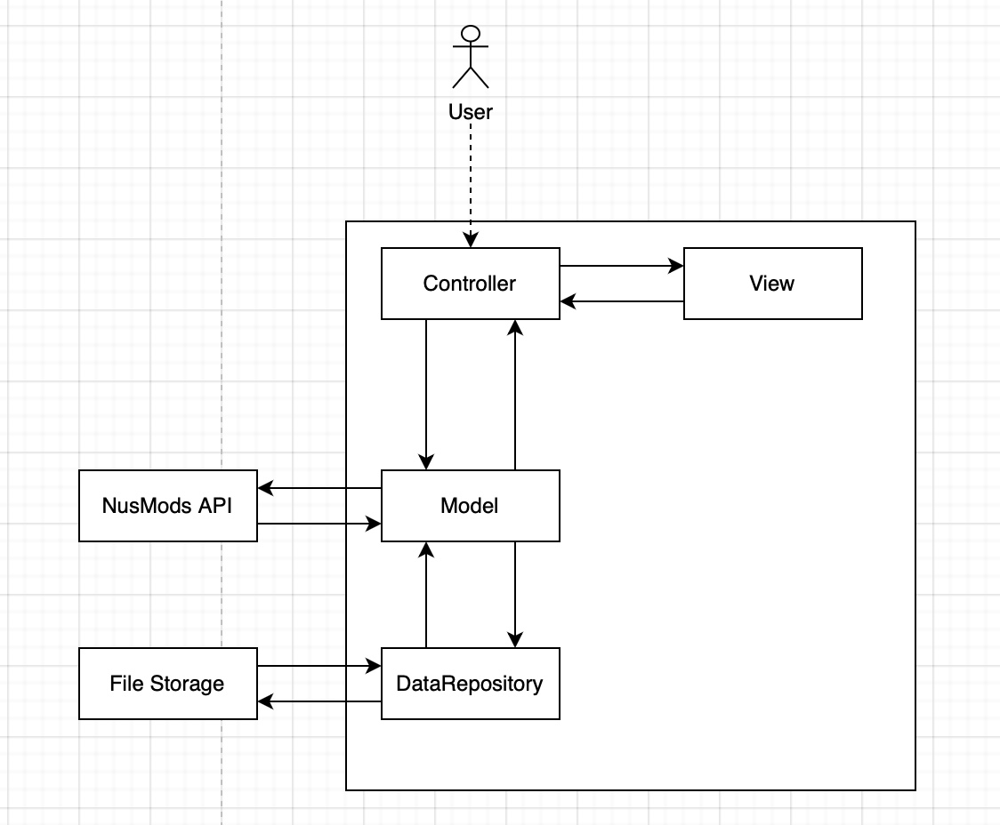
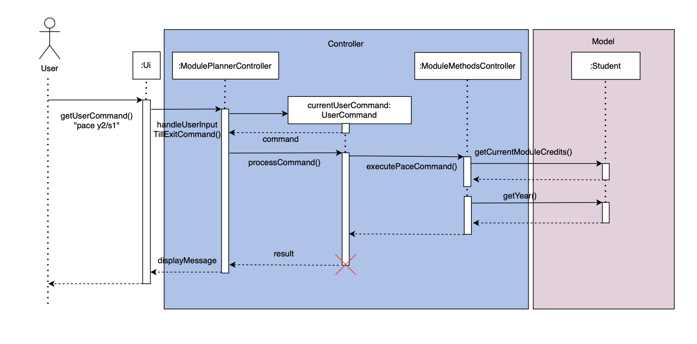
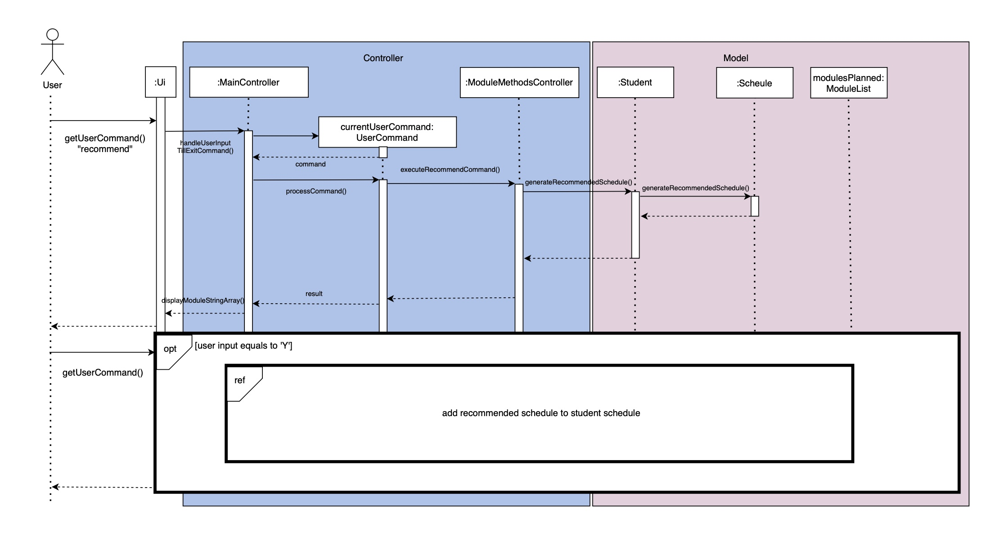
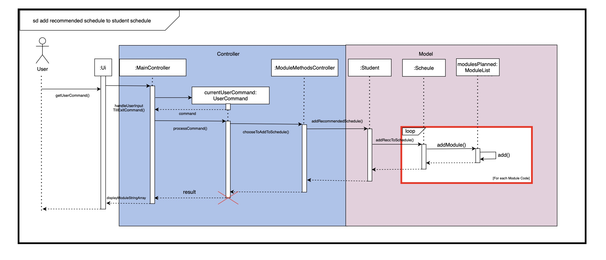

<h1 style="text-align: center; 
background-image: linear-gradient(to right, #370505, #5b2829, #814c4c, #a97171, #d19999);">
    
</h1>

<h1>
<span style="background-image: linear-gradient(to right, #14499b, #0065b7, #0081d1, #009ee9, #00bcff);
-webkit-background-clip: text; color: transparent;">N</span>US 
<span style="background-image: linear-gradient(to right, #e50000, #e84034, #e6615a, #de7e7b, #d19999);
-webkit-background-clip: text; color: transparent;">D</span>EGs
<span style="background-image: linear-gradient(to right, #9b2614, #b70036, #c3006b, #ac00b2, #002cff);
-webkit-background-clip: text; color: transparent;">Developer Guide</span>
</h1>
## Acknowledgements

{list here sources of all reused/adapted ideas, code, documentation, and third-party libraries -- include links to the original source as well}

## Design & implementation, Architecture



The Architecture Diagram given above explains the high-level design of the application.

The main logic of the application is handled by these four components
- **Controller**: 
  - Handles Commands coming from the User 
  - Combines data from the **Model** and UI Components from **View**
  - Never handles data logic
- **View**:
  - Responsible for printing onto the Command Line Application
- **Model**:
  - Stores the data and data logic methods that handles and manages the data 
  - Performs REST API calls to the NUSMODS API
  -
  - Responsible for retrieving data from the **Data Repository**
  - does not depend on any of the other three components (as the Model represents data entities of the domain, they should make sense on their own without depending on other components)


- **Storage**:
  - can save both schedule data and user data in .txt format, and read them back into corresponding objects.
  - depends on some classes in the Model component

### How the architecture components interact with each other


The Sequence Diagram above shows how the components interact with each other when the user inserts a module 
into his schedule

### View Component
The component is specified in Ui.java


The `UI` component:

- displays messages to the user by printing to the CLI
- displays results from commands executed by the ModulePlannerController class

### Controller Component


The `Controller` component:

1. Input from the user is received through `Ui` class, is the pass into `ModulePlannerController`.
2. When `ModulePlannerController` is called upon to execute a command, it uses the `Parser` class to parse for 
`UserCommand`.
2. This results in a `UserCommand` object which is executed by the `ModulePlannerController`.
3. The `UserCommand` calls the methods specific to each `UserCommand` from `ModuleMethodsController`.
(`ModuleServiceController` contains helper functions for `ModuleMethodsController`) 
4. The result of the command execution is returned to the `Ui` and printed to the CLI.

### Model Component
The component is specified in .java


The `` component:

-

### Storage Component
The component is specified in the `storage` package and facilitated by StorageManager.java


The `storage` component:

- can save the student's name, major and year to `studentDetails.txt` whenever the user starts NUSDegs for the first time
and read them back into corresponding objects.
- can save the student's schedule and timetable whenever it is updated in NUSDegs and read them back into corresponding 
objects.
- uses `FileDecoder` class to read saved files in the data folder back to `Student` object.
- uses `ResourceStorage` to store and retrieve core module details for CEG and CS.
- depends on some classes in the `Model` component (because the `Storage` component's job is to save/retrieve objects
that belong to the `Model`)


## Features featured in Developer's Guide: 
- Pace
- Recommend
- Left
- Add
- Clear
- Required
- Info (description, command)
- Search 


# Implementation

## Pacing and MC Calculation

The following sequence diagram shows how the pace command function works.




The "Pacing and MC Calculation" mechanism is implemented to help users track their 
academic progress and remaining Modular Credits (MCs) required for graduation. 

This feature is facilitated by the `ModuleMethodsController`. It calculates the average amount of modular credits the user 
has to take in each semester in order to graduate on time.

### Usage Examples

Here are a few examples of how the "Pacing and MC Calculation" feature behaves:

#### Example 1: Calculate Remaining MCs

Command: `pace Y1/S1` (assuming 0 modular credits were done in semester one)

Response:

`You have 160MCs for 7 semesters. Recommended pace: 23MCs per sem until graduation`

#### Example 2: Calculate Remaining MCs (No Semester Specified)

Note: If no semester is specified, we will take the initial semester that the user has inputted upon initialisation. 

Command: `pace` (Assuming user is y2/s1 and has completed 40 modular credits)

Response:

`You have 120MCs for 6 semesters. Recommended pace: 20MCs per sem until graduation`

## Recommend Schedule Based on Course

The following sequence diagrams shows how the recommend command function works.

Recommended a schedule based on the user's major:



Recommended a schedule based on the user's major:





Based on the course, we will provide a recommended schedules that is sorted based on prerequisites. 

This feature is facilitated by the `ModuleMethodsController`. which stores information about the schedule and performs actions like add and remove from schedule.

### Usage Examples

Here are a few examples of how the "Recommend schedule" feature behaves:

#### Step 1: Recommend schedule for computer engineering(CEG)

Command: `recommend` 

Response:

```
1. GEA1000     2. MA1511      3. MA1512      4. DTK1234     5. GESS1000
6. CS1231      7. CS1010      8. GEN2000     9. EG2501      10. EG1311
11. GEC1000    12. PF1101     13. CDE2000    14. IE2141     15. CG1111A
16. EG2401A    17. ES2631     18. ST2334     19. MA1508E    20. CG2023
21. CG2111A    22. CS2040C    23. CG2027     24. EE2026     25. EE4204
26. EE2211     27. CG2271     28. CS2113     29. CG2028     30. CP3880
31. CG4002     
Here you go!
Taking the modules in this order will ensure a prerequisite worry free uni life!
Do you want to add this to your schedule planner? (This will overwrite your current schedule!)
Please input 'Y' or 'N' 
```


#### Step 2 (Only to be done after step 1): 

Command: `Y`

Response:

```
Here is your schedule planner!
Sem 1:   X GESS1000     X DTK1234      X MA1512       X MA1511       X GEA1000      
Sem 2:   X EG1311       X EG2501       X GEN2000      X CS1010       X CS1231       
Sem 3:   X CG1111A      X IE2141       X CDE2000      X PF1101       X GEC1000      
Sem 4:   X CG2023       X MA1508E      X ST2334       X ES2631       X EG2401A      
Sem 5:   X EE4204       X EE2026       X CG2027       X CS2040C      X CG2111A      
Sem 6:   X CG2028       X CS2113       X CG2271       X EE2211       
Sem 7:   X CG4002       X CP3880       
Sem 8:   
Happy degree planning!
```

## List Required Modules Left Feature

The following sequence diagram shows how the Left Command function works.


When the user's command is determined to be `left`, the program implements the following operations:
### Function List

- `new ArrayList<String>()`: Instantiate moduleCodesLeft
- `student#getModuleCodesLeft()`: Returns the ArrayLis
- `schedule#getModulesPlanned()`: Returns modulesPlanned (Module List)
- `modulesPlanned#getCompletedModuleCodes()`: Returns completedModuleCodes (ArrayList <String>)
- `completedModuleCodes#contains(moduleCode)`: Returns true if completedModuleCodes contain moduleCode
- `moduleCodesLeft#add(moduleCode)`: Add moduleCode to moduleCodesLeft
- `ModuleMethodsController#showModulesLeft(moduleCodesLeft)`: Calls methods `displayMessage("Modules Left:")` and 
`printModuleStringArray(moduleCodesLeft)` to display the modules left to the user

  
### Usage Examples

Here are a few examples of how the List Required Modules Left Feature behaves:

#### Example 1: 
- Major is CEG
- Modules CG1111A, MA1511, MA1512, CS1010, GESS1000, CFG1002 are added to schedule planner and completed

Command: `left`

Response:

```
Required Modules Left:
1. GEC1000     2. GEN2000     3. ES2631      4. GEA1000     5. DTK1234
6. EG1311      7. IE2141      8. EE2211      9. EG2501      10. CDE2000
11. PF1101     12. CG4002     13. MA1508E    14. EG2401A    15. CP3880
16. CG2111A    17. CS1231     18. CG2023     19. CG2027     20. CG2028
21. CG2271     22. ST2334     23. CS2040C    24. CS2113     25. EE2026
26. EE4204    
```


## Add Module Feature

The add module mechanism is facilitated by `ModuleMethodsController`. It tries to add the module to a target semester, 
specified in userInput by the user, to their module schedule planner. It will print different responses based on whether
the adding of module was successful.

### Usage Example

Here is an example of how the add module feature behaves:

#### Example:

**Step 1.** The user inputs the `add CS1010 1` command to insert the module CS1010 to Year 1 Semester 1 of their 
schedule. The add UserCommand() object is created from the user input.

**Step 2.** If the user inputs are valid, `processCommand` is called by the UserCommand object. The command is then
passed to the `ModuleMethodsController` through `executeAddModuleCommand()`. The `ModuleMethodsController` would then
call the `addModuleToSchedule()` method in `Student`, which would then continue to call the `addModule()` method in
`Schedule` and finally the `modulesPlanned` object.

**Step 3.** Upon successful execution of all of the above, `ModuleMethodsController` would then construct a message
which also includes an updated schedule which would be returned to the `UI` class to be formatted to the Command Line
Interface.

The following sequence diagram shows how the `add` command works:


## Clear Schedule Feature

The clear schedule mechanism is facilitated by `ModuleMethodsController`. It clears the schedule of the user and resets
the completion data of the modules in the schedule.

### Usage Examples

Here is an example of how the clear schedule feature behaves:

#### Example 1:

**Step 1.** The user inputs the `clear` command to clear their schedule. The clear UserCommand() object is created 
from the user input.

**Step 2.** If the user inputs are valid, `processCommand` is called by the UserCommand object. The command is then
passed to the `ModuleMethodsController` through `executeClearModuleCommand()`. The `ModuleMethodsController` would then
call the `clearAllModuleFromSchedule()` method in `Student`, which would replace the current `Schedule` object in 
`Student` with a new schedule and reset `completedModuleCredits` in the `Student` object to 0.

**Step 3.** Upon successful execution of all of the above, `ModuleMethodsController` would then construct a message
which would be returned to the `UI` class to be formatted to the Command Line Interface.

The following sequence diagram shows how the `clear` command works:


## Required Command

The following sequence diagram shows how the Required Command function works.


The required command is implemented to give users an overview of the modules they need to complete for 
their major. It is facilitated by major. Additionally, it implements the following operations:

- `Student#getMajor()` – Returns the `major` of the student.
- `ModuleServiceController#getRequiredModules(major)` and `ModuleServiceController#printRequiredModules(major)` – 
Displays the modules required.

### Usage Examples

Here are a few examples of how the Show Required Modules Feature behaves:

#### Example 1:

Command: `required`

Response:
Module requirements for major selected by user

## Get information about modules (from the NUSMods API)


The information feature returns information about the module at the user's request. It accepts 3 commands, 
'description', 'workload' and 'all'. The 'description' command returns a string description of the module, the workload
command returns an array, and all displays the module title and module code for all modules present in the NUSMods 
directory.

- `getFullModuleInfo(major)` – Returns the `filePath` for the requirements of a specified major.
- `sendHttpRequestAndGetResponseBody(String url)` – Displays the overview of modules required.
- `getDescription(String moduleCode)` – Returns the `longestLineLength` of the file f.
- `listAllModules(), `printDoubleTopLine()`, `printBottomLine()`, `printDoubleBottomLine()` – Displays lines for formatting
- `infoCommands(String command, String userInput), `printDoubleTopLine()`, `printBottomLine()`, `printDoubleBottomLine()` – Displays lines for formatting

### Usage Examples

Here are a few examples of how the Show Required Modules Feature behaves:

#### Example 1:

Command: `required`

Response:
Module requirements for major selected by user

## Modify lessons in the Weekly Timetable

User Input: `timetable modify`

The following sequence diagram details the process of the 'timetable modify loop'

[timetableModify.puml](diagrams%2FtimetableModify.puml)


### Function List

- `getUserCommand`: Retrieves user input for a timetable command.
- `getArguments`: Retrieves arguments from a TimetableUserCommand.
- `isModifyExit`: Checks if the user entered 'exit' as an argument.
- `addLecture`: Adds a lecture to the selected module.
- `addTutorial`: Adds a tutorial to the selected module.
- `addLab`: Adds a lab to the selected module.
- `isModifyClear`: Removes all lessons for the selected module.
- `saveTimetable`: Saves the current timetable to storage.
- `printTimetable`: Returns a formatted timetable display to the command-line interface.

## Show Weekly Timetable Feature

User Input: `timetable show`

The following sequence diagram shows how the timetable show feature works:


The following sequence diagram shows how the printTimetable operation works:


When the user's command is determined to be `timetable show`, the program implements the following operations:
### Function List (when timetableCommandWord == "SHOW")

- `getCurrentSemesterModulesWeekly()`: Returns the ArrayList of ModuleWeekly for the current semester
- `showTimetable(ArrayList<ModuleWeekly> currentSemModulesWeekly)`: Calls the printTimetable function 
- `printTimetable(ArrayList<ModuleWeekly> currentSemModulesWeekly)`: Prints the Weekly Timetable to the console
- `createDailyEvents(ArrayList<ModuleWeekly> \ncurrentSemesterModules)`: Converts the ArrayList<ModuleWeekly> to a 
List of ArrayList<Events> for different days
- `sortByTime(ArrayList<Event> currentDayEvents)`: Sorts Events in currentDayEvents by start time, duration, then 
module code, in ascending order
- `printTimetableHeader()`: Display timetable header
- `printlnHorizontalLine()`: Display horizontal line
- `printCurrentDayEvents(ArrayList<Event> currentDayEvents, day)`: Display the day's events

### Design considerations
Aspect: How timetable is printed:

#### Current implementation: One row per day
- Pros: Each table cell can be wider allowing each event to be printed in 1 line
- Cons: The user needs to read the time for each event to understand when they are free.

#### Previous implementation: One row per hour, one column per day
- Pros: The user can see when they are free by day and hour easily
- Cons: The console must be wide enough for it to be usable and aesthetic. Each table cell for an event was only about 
11 characters wide.

  
## Product scope
### Target User Profile

- Computer Engineering and Computer Science Students at NUS

- **Desktop CLI Preference:** Students in Computer Engineering 
and Computer Science at NUS show a preference for desktop 
Command Line Interface (CLI) apps over other planners.

- **Typing-Centric Interaction:** This group favors 
typing for efficiency, valuing keyboard-based operations
over mouse interactions.

- **Minimization of NUSMods Website Reliance:** These
students seek to reduce dependence on frequent 
NUSMods website visits. Instead, they prefer 
a comprehensive planner in a desktop CLI
environment, meeting their specific needs.


### Value Proposition

Efficiently navigate and organize a planner without 
the typical delays associated with mouse-driven GUI 
applications. Recognizing the substantial module load
and hectic schedules faced by NUS engineering students 
throughout their four-year program, this application is
designed to streamline the module planning process. By
eliminating the need for frequent reference to various 
websites and GUIs, such as NUSMods and scheduling sites,
the app aims to enhance the efficiency of module 
planning for these students.

## User Stories

| Version | As a ... | I want to ...                                                                     | So that I can ...                                           |
|---------|----------|-----------------------------------------------------------------------------------|-------------------------------------------------------------|
| v1.0    | new user | view help                                                                         | refer to them when I forget how to use the application      |
| v1.0    | user     | view my pace                                                                      | graduate on time                                            |
| v1.0    | user     | view the required modules I am left with for my major                             | plan ahead for other semesters                              |
| v2.0    | user     | search for specific modules based on keywords, course codes, or professors' names | quickly find the modules I need for my semesters            |
| v2.0    | user     | alter (add, swap, delete) the modules in the schedule planner                     | update the recommended schedule to my preferences           |
| v2.0    | user     | get the recommended schedule for my major                                         | have a starting point to use the app                        |
| v2.0    | user     | get an overview of module requirements for my major                               | know which modules I must take to graduate                  |
| v2.1    | user     | shift the modules in the schedule planner                                         | more easily edit my schedule and save more time             |
| v2.1    | user     | plan my weekly timetable for my current semester                                  | keep track of my weekly lessons for my current semester     |
| v2.1    | user     | mark modules I have added as completed                                            | keep track of my progress                                   |

## Non-Functional Requirements

{Give non-functional requirements}

## Glossary

* *glossary item* - Definition

## Instructions for manual testing

{Give instructions on how to do a manual product testing e.g., how to load sample data to be used for testing}
