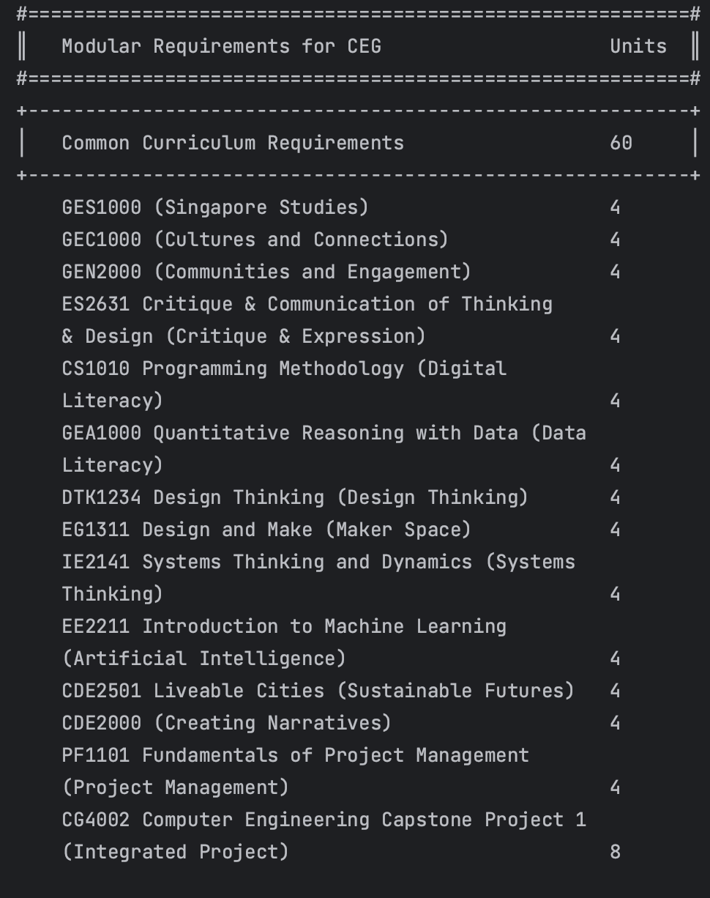
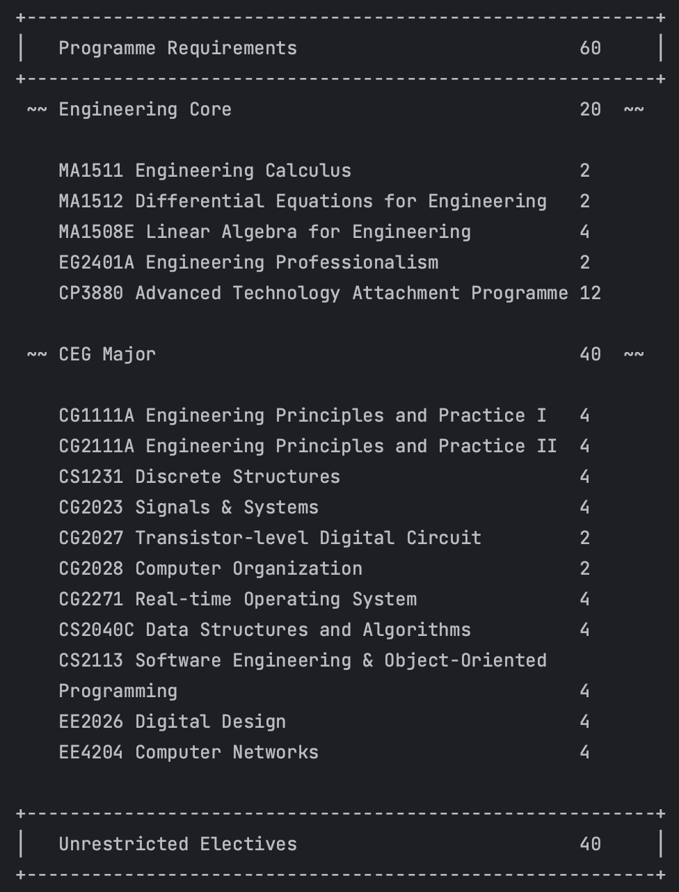
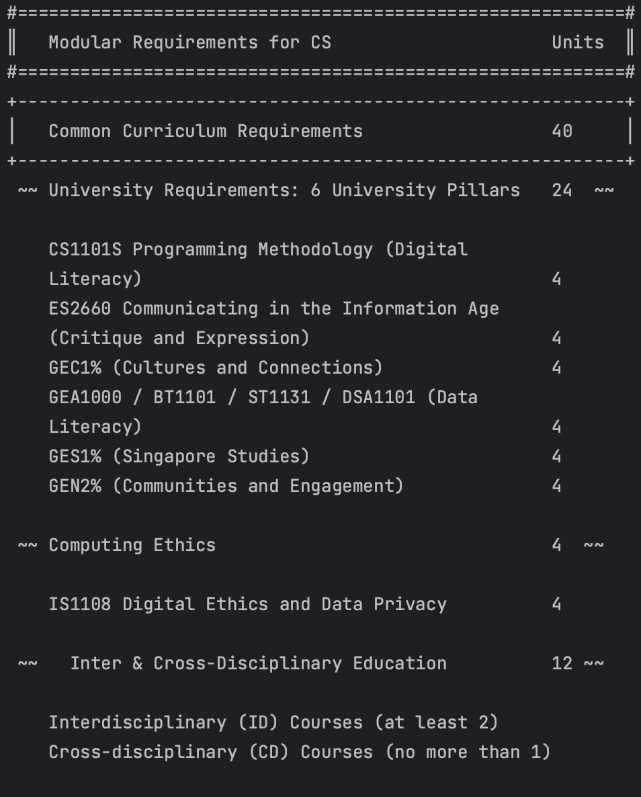
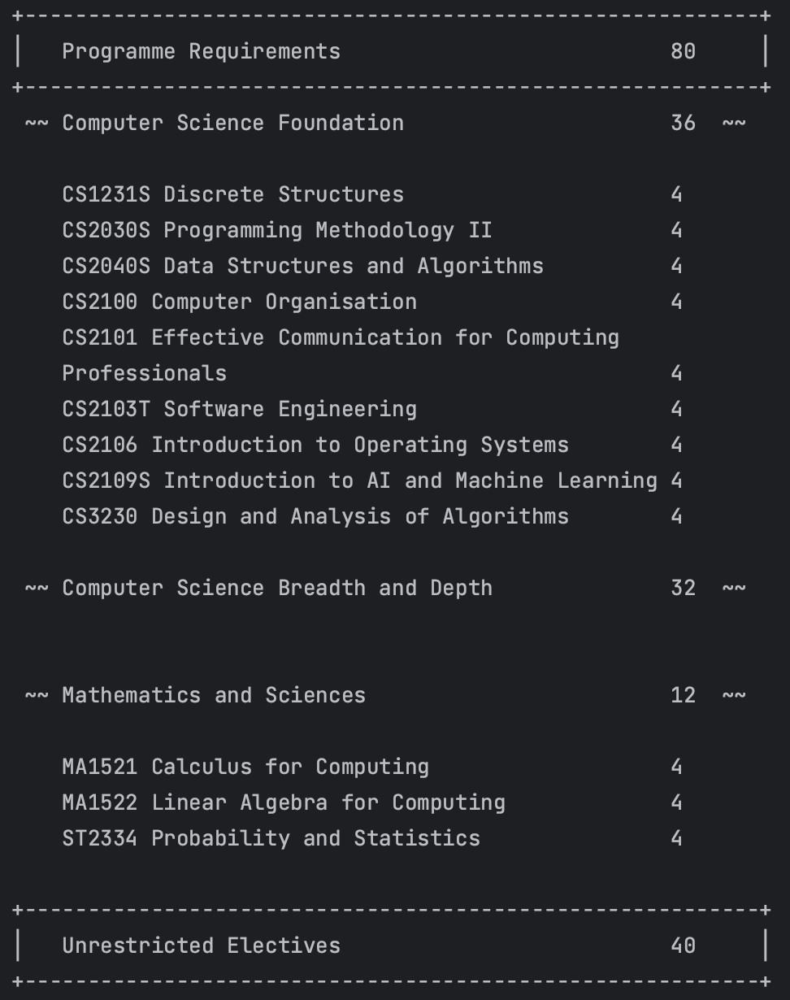
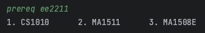
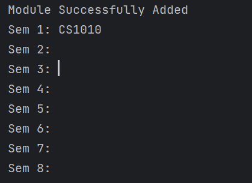
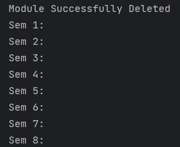
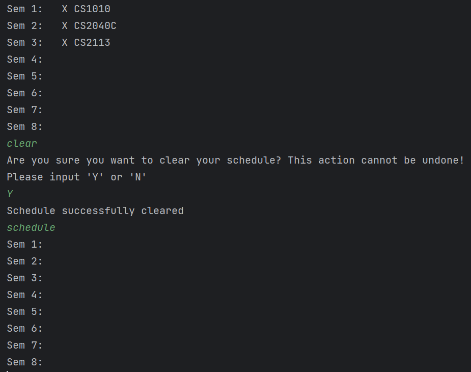

<h1 style="text-align: center; 
background-image: linear-gradient(to right, #370505, #5b2829, #814c4c, #a97171, #d19999);">
    
</h1>

<h1>
NUS 
DEGS
User Guide
</h1>

## Introduction

NUSDegs streamlines computing degree planning by offering personalized module schedules, tracking progress, 
and ensuring on-time graduation. It eliminates guesswork, reduces stress, and saves time for students. 
It's a comprehensive tool for efficient and successful degree completion.

## Quick Start

1. Ensure that you have Java 11 or above installed.
2. Download the latest version of `NUSDegs` from [here](http://link.to/duke).

## Features
- View help : `help`
- View modules required for major: `required`
- Recommend a schedule based on major: `recommend`
- Search for modules based on keywords: `search`
- View info about a module: `info`
- Check prerequisite for a module: `prereq`
- View schedule planner: `schedule`
- Add module to schedule planner: `add`
- Delete module from schedule planner: `delete`
- Shift module in schedule planner: `shift`
- Clear all modules from schedule planner: `clear`
- Complete a module in your schedule planner: `complete`
- View modules left for graduation: `left`
- Check current pace to graduate: `pace`

### Viewing help: `help`

To view a list of all possible commands, a brief description of their functionality and syntax.

##### Format: `help`

### Getting a list of required modules:`required`
Get an overview of required modules for the user's major

##### Format: `required`

#### Example of usage 1: (user's major is CEG)

User input:
`required`

- Expected outcome:

#### Example of usage 2: (user's major is CS)

User input:
`required`

- Expected outcome:

### View module prerequisites:`prereq`
Based on the module selected, we will show what prerequisites the course has.

##### Note:
- Since NUS has the concept of preclusions, when prerequisites are shown, it is shown based on the degree of the current 
user.

- If the module is not a requisite of the students major, we will only show one preclusion as a prerequisite

##### Format: `prereq MODULE_CODE`

- The input is not case-sensitive. E.g. eg1311 or EG1311 is shown
out

#### Example of Usage:

User input:
`prereq eg1311` 

Assuming the user is from Computer Engineering

- Expected Outcome

### Searching for a module by title: `search`
Search for module title using a keyword.

##### Format: `search KEYWORD`

* The `KEYWORD` cannot be empty.

#### Example of usage:

User input:
`search Darwinian`

- Expected outcome:\
  _________________________________________\
  These are the modules that contain your keyword in the title:
  
  Title: Junior Seminar: The Darwinian Revolution
  Module Code: UTC1102B\
  _________________________________________\
- 
### Get information about a module: `info`
Get information about a module using the info command, followed by the command 'description'.

##### Format: `info COMMAND MODULE_CODE`

* The `COMMAND` cannot be empty.
* The `MODULE_CODE` cannot be empty.

#### Examples of usage:

User input:
`info description CS2113`

- Expected outcome: This course introduces the necessary skills for systematic and rigorous development of software 
systems. It covers requirements, design, implementation, quality assurance, and project management aspects of 
small-to-medium size multi-person software projects. The course uses the Object Oriented Programming paradigm. 
Students of this course will receive hands-on practice of tools commonly used in the industry, such as test automation 
tools, build automation tools, and code revisioning tools will be covered.

User input:
`info workload CS2113`

- Expected outcome: "[2,1,0,3,4]"

User input:
`info all`

- Expected outcome: Displays module title and module code of all available modules

### View schedule planner: `schedule`
Shows the user their current schedule planner

##### Format: `schedule`

- The input does not accept any arguments after the command word.

#### Example of usage: 

User input: `schedule`

- Expected outcome(if user has not inputted any modules):

### View recommended schedule based on course: `recommend`
Based on the student's course, we will provide a recommended schedule that is sorted based on prerequisites.

##### Format: `recommend`

#### Example of usage:

User input:
`recommend`

- Expected outcome:

- If the user enters `Y`, the recommended schedule will be added to their schedule

### Add module to schedule planner: `add`
Opens the user's personalized module schedule planner and adds the chosen module to the semester specified by the user.
Adding will not be allowed if the current schedule planner does not contain the required prerequisites.

##### Format: `add MODULE_CODE SEMESTER`

* `MODULE_CODE` cannot be empty and must be valid.
* `SEMESTER` cannot be empty and must be an integer between 1-8 inclusive.

#### Example of usage:

User input:
`add CS1010 1`

- Expected outcome:

### Delete module from schedule planner: `delete`
Opens the user's personalized module schedule planner and deletes the chosen module. Deleting will not be allowed if
the module to be deleted is a prerequisite of a module in later semesters on the schedule planner.

##### Format: `delete MODULE_CODE`

* `MODULE_CODE` cannot be empty and must be valid.
* `MODULE_CODE` must also be in the current schedule planner

#### Examples of usage:

User input:
`delete CS1010` (Assume schedule is currently in the state from the example in `add`)

- Expected outcome:

### Shift module in schedule planner: `shift`
Opens the user's personalized module schedule planner and shifts the chosen module to the semester specified by the 
user. Shifting will not be allowed if it causes conflicts with other modules in the schedule planner.

##### Format: `shift MODULE_CODE SEMESTER`

* `MODULE_CODE` cannot be empty and must be valid.
* `MODULE_CODE` must also be in the current schedule planner
* `SEMESTER` cannot be empty and must be an integer between 1-8 inclusive.

#### Example of usage:

User input:
`shift CS1010 2`

### Clear all schedule planner and completion data: `clear`
Deletes every module in the module schedule planner and their completion data. The user will be prompted to confirm this
action as this command cannot be undone.

##### Format: `clear`

#### Example of usage:

User input:
`clear`

* Expected outcome:

### Complete a module: `complete`
Completes a module (Completes a module in your schedule planner).

#### Note: 
- The module you complete has to be first added in your schedule planner! 

##### Format: `complete MODULE_CODE`

#### Example of usage 1: (scenario where user's selected major is CEG)

User input:
`complete ma1511`

Expected outcome:
`Mod completed: MA1511`

### Checking modules left: `left`
Displays the modules left, which are the modules required for the user's major that have not been completed.

#### Format: `left`

Example of usage 1: (major is CEG, no modules completed)

User input:
`left`

- Expected outcome:

#### Example of usage 2: (major is CEG, CS1010 & GEC1000 are added and completed)

User input:
`left`

- Expected outcome:
  

### Check current pace to graduate: `pace`

Based on the modules that have been completed, t
The user can see how many MCs are left and how much time is left to complete the required MCs.

#### Format: `pace`

#### Note:
- If no argument is given, we will take the year that you have initially inputted.

- If an argument is given, we will take the academic year given and calculate the pace based on that.

#### Example of Usage:

User input:
`pace y1/s1`

- Expected outcome: assuming 0 modular credits were done in semester one

### View Weekly Timetable: `timetable show`

Timetable view displays lectures, tutorials and classes for each module in the student's current semester. 

Format: `timetable show`

if no argument lectures, tutorials and classes are input, program will display this: 

User input:
`timetable show`

Expected outcome: when GESS1000 has a lecture at 11 on Tuesday and CS2101 has a tutorial at 10 on Monday.

### Modify Weekly Timetable: `timetable modify`

Add lectures, tutorials and classes for each module in the student's current semester.

Format: `timetable modify`

if no modules are scheduled for current semester, program will display this:

User input:
`timetable modify`

Expected outcome: when GESS1000 has a lecture at 12 for 3 hours
on Tuesday and CS2101 has a tutorial at 10 for 1 on Monday.

## FAQ

**Q**: How do I transfer my data to another computer? 

**A**: Currently, this feature is not included in NUSDegs.

## Command Summary
Note: if an argument is wrapped with `[]` it means that it is optional. 

| **Command**                                    | **Format**                        |
|------------------------------------------------|-----------------------------------|
| View Help                                      | `help`                            |
| View modules left for graduation               | `left`                            | 
| Check prerequisite for a module                | `prereq MODULE_CODE`              | 
| Search for modules based on keywords           | `search KEYWORD`                  | 
| View info about a module                       | `info description <MODULE_CODE>`        | 
| View modules required for major                | `required`                        | 
| View schedule planner                          | `schedule`                        | 
| Recommend a schedule based on major            | `recommend`                       | 
| Add module to schedule planner                 | `add MODULE_CODE SEMESTER_NUMBER` | 
| Delete module from schedule planner            | `delete MODULE_CODE`              |
| Shift module in schedule planner               | `shift MODULE_CODE SEMESTER`      |
| Clear all schedule planner and completion data | `clear`                           |
| Complete a module in your schedule planner     | `complete MODULE_CODE`            |
| Check current pace to graduate                 | `pace [CURRENT_SEMESTER]`         | 
| Modify weekly timetable                        | `timetable modify`                |
| Show weekly timetable                          | `timetable show`                  |