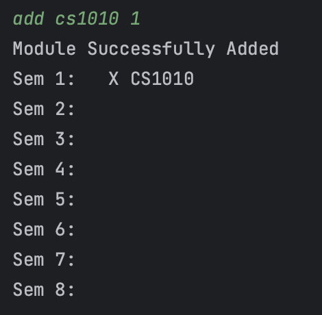
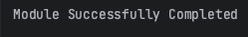

<h1 style="text-align: center; 
background-image: linear-gradient(to right, #370505, #5b2829, #814c4c, #a97171, #d19999);">
    
</h1>

<h1>
NUS 
DEGS
User Guide
</h1>

## Introduction

NUSDegs streamlines computing degree planning by offering personalized module schedules, tracking progress, 
and ensuring on-time graduation. It eliminates guesswork, reduces stress, and saves time for students. 
It's a comprehensive tool for efficient and successful degree completion.

## Quick Start

1. Ensure that you have Java 11 or above installed.
2. Download the latest version of `NUSDegs` from [here](https://github.com/AY2324S1-CS2113-T17-4/tp/releases/tag/vbeta) (
   (Real one to be updated for PE)
3. Downlaod the NUSDegs.jar to the folder you want to use as the home folder for NUSDegs.
4. Open a command terminal, cd into the folder you put the .jar file in, and run the command
   java -jar "NUSDegs.jar" to run the application.

## Note
1. Year 4 Semester 2 students aren't able to use the app! (As we specifically cater the app to only students who have at
least one semester left!)
2. Due to the requirements of the CS2113, users are allowed to edit the txt files created. However, the course 
should not be modified from "CEG" to "CS" and vice versa 
in the txt file as it will break the prerequisite constraints in your 
schedule and may cause the schedule to not work as intended (e.g show the incorrect preclusion). 
   1. This is due to the prerequisite algorithm that takes into account your course. Hope you understand!
3. Users are strongly **recommended to not modify the data/schedule.txt** as well as the schedule is supposed to be sorted
based on prerequisites. Hence, a manual modification of an invalid module into the schedule.txt file may cause your schedule info 
to be corrupted and therefore lost!
4. The prerequisites are calculated using NUSMods API, any inaccuracies may be due to the NUSMods API provider.

## Features
- [View help : `help`](#viewing-help-help)
- [View modules required for major: `required`](#getting-a-list-of-required-modulesrequired)
- [Check prerequisite for a module: `prereq`](#view-module-prerequisitesprereq)
- [Search for modules based on keywords: `search`](#searching-for-a-module-by-title-search)
- [View info about a module: `info`](#get-information-about-a-module-info)
- [View schedule planner: `schedule`](#view-schedule-planner-schedule)
- [Recommend a schedule based on major: `recommend`](#view-recommended-schedule-based-on-course-recommend)
- [Add module to schedule planner: `add`](#add-module-to-schedule-planner-add)
- [Delete module from schedule planner: `delete`](#delete-module-from-schedule-planner-delete)
- [Shift module in schedule planner: `shift`](#shift-module-in-schedule-planner-shift)
- [Clear all schedule planner and completion data: `clear`](#clear-all-schedule-planner-and-completion-data-clear)
- [Complete a module in your schedule planner: `complete`](#complete-a-module-complete)
- [View modules left for graduation: `left`](#checking-modules-left-left)
- [Check current pace to graduate: `pace`](#check-current-pace-to-graduate-pace)
- [View weekly timetable: `timetable show`](#view-weekly-timetable-timetable-show)
- [Modify weekly timetable: `timetable modify`](#modify-weekly-timetable-timetable-modify)
- [Saves the user's schedule and exits the program: `bye`](#save-schedule-and-timetable-and-exit-the-program-bye)

Note: Between arguments, spaces are required. Arguments need to be passed in the correct order.

### Viewing help: `help`

To view a list of all possible commands, a brief description of their functionality and syntax.

##### Format: `help`

User input:
`help`

- Expected outcome:

### Getting a list of required modules:`required`
Get an overview of required modules for the user's major

##### Format: `required`

##### Example of usage 1: (user's major is CEG)

User input:
`required`

- Expected outcome:

##### Example of usage 2: (user's major is CS)

User input:
`required`

- Expected outcome:

### View module prerequisites:`prereq`
Based on the module selected, we will show what prerequisites the course has.

##### Note:
- Since NUS has the concept of preclusions, when prerequisites are shown, it is shown based on the degree of the current 
user.

- If the module is not a requisite of the students major, we will only show one preclusion as a prerequisite

##### Format: `prereq MODULE_CODE`

- The input is not case-sensitive. E.g. eg1311 or EG1311 is shown
out

##### Example of Usage:

User input:
`prereq eg1311` 

Assuming the user is from Computer Engineering

- Expected Outcome

### Searching for a module by title: `search`
Search for module title using a keyword.

##### Format: `search KEYWORD`

* The `KEYWORD` cannot be empty.

##### Example of usage:

User input:
`search Darwinian`

- Expected outcome:\
  _________________________________________\
  These are the modules that contain your keyword in the title:
  
  Title: Junior Seminar: The Darwinian Revolution
  Module Code: UTC1102B\
  _________________________________________\

### Get information about a module: `info`
Get information about a module using the info command, followed by the command 'description'.

##### Format: `info COMMAND MODULE_CODE`

* The `COMMAND` cannot be empty.
* The `MODULE_CODE` cannot be empty.

##### Examples of usage:

User input:
`info description CS2113`

- Expected outcome: This course introduces the necessary skills for systematic and rigorous development of software 
systems. It covers requirements, design, implementation, quality assurance, and project management aspects of 
small-to-medium size multi-person software projects. The course uses the Object Oriented Programming paradigm. 
Students of this course will receive hands-on practice of tools commonly used in the industry, such as test automation 
tools, build automation tools, and code revisioning tools will be covered.

### View schedule planner: `schedule`
Shows the user their current schedule planner

##### Format: `schedule`

- The input does not accept any arguments after the command word.

##### Example of usage: 

User input: `schedule`

- Expected outcome(if user has not inputted any modules):

### View recommended schedule based on course: `recommend`
Based on the student's course, we will provide a recommended schedule that is sorted based on prerequisites.

##### Format: `recommend`

##### Example of usage:

User input:
`recommend`

##### Note:
- Even if you have inputted Y2/S2(Year 2, Semester 2) for example, we would still recommend you a schedule with all the
required modules from Year 1, Semester 1 till Year 4 semester 2 as the goal of the recommend function is to provide you
a template order of you can take your modules!

User input:
`recommend`

- Expected outcome:

- If the user enters `Y`, the recommended schedule will be added to their schedule

### Add module to schedule planner: `add`
Opens the user's personalized module schedule planner and adds the chosen module to the semester specified by the user.
Adding will not be allowed if the current schedule planner does not contain the required prerequisites.

##### Format: `add MODULE_CODE SEMESTER`

* `MODULE_CODE` cannot be empty and must be valid.
* `SEMESTER` cannot be empty and must be an integer between 1-8 inclusive.

##### Note:
- We do not check for preclusions when adding. (It is something we hope to implement in the future!)
- E.g. If you have added CS2040C in your schedule, you are still able to add CS2040 even though it is a preclusion.

##### Example of usage:

User input:
`add CS1010 1`

- Expected outcome:

### Delete module from schedule planner: `delete`
Opens the user's personalized module schedule planner and deletes the chosen module. Deleting will not be allowed if
the module to be deleted is a prerequisite of a module in later semesters on the schedule planner.

##### Format: `delete MODULE_CODE`

* `MODULE_CODE` cannot be empty and must be valid.
* `MODULE_CODE` must also be in the current schedule planner

##### Note:
- Our delete function checks for validity of deletion by checking for the modules it 'unlocks', hence if you 
were to add a module in semester one, but the following semester has already a module it 'unlocks', 
you will not be able to delete it without deleting the module it satisfies! (However this is something we do as well 
want to work on as well in the future!)
- E.g. If you have both CS1010 and CS1101S in semester 1, and CS2040C in semester 2, you are unable to delete both
CS1010 or CS1101S, even though just one of them is sufficient to unlock CS2040C.

##### Examples of usage:

User input:
`delete CS1010` (Assume schedule is currently in the state from the example in `add`)

- Expected outcome:

### Shift module in schedule planner: `shift`
Opens the user's personalized module schedule planner and shifts the chosen module to the semester specified by the 
user. Shifting will not be allowed if it causes conflicts with other modules in the schedule planner.

##### Format: `shift MODULE_CODE SEMESTER`

* `MODULE_CODE` cannot be empty and must be valid.
* `MODULE_CODE` must also be in the current schedule planner
* `SEMESTER` cannot be empty and must be an integer between 1-8 inclusive.

##### Note:
- Similar to the delete feature, shifting a module later checks for validity of shifting by checking for the modules it 
'unlocks', hence if there were two modules in semester 1 that both individually could satisfy a module in semester 2, you
would not be able to shift any of the two semester 1 modules. (However this is something we do as well
  want to work on as well in the future!)
- E.g. If you have both CS1010 and CS1101S in semester 1, and CS2040C in semester 2, you are neither able to shift 
  CS1010 nor CS1101S to semester 2 onwards, even though just one of them is sufficient to unlock CS2040C.

##### Example of usage:

User input:
`shift CS1010 2`

### Clear all schedule planner and completion data: `clear`
Deletes every module in the module schedule planner and their completion data. The user will be prompted to confirm this
action as this command cannot be undone.

##### Format: `clear`

##### Example of usage:

User input:
`clear`

* Expected outcome:

### Complete a module: `complete`
Completes a module (Completes a module in your schedule planner).

#### Note: 
- The module you complete has to be first added in your schedule planner!

##### Format: `complete MODULE_CODE`

##### Example of usage 1: (scenario where user's selected major is CEG)

User input:
`complete ma1511`

Expected outcome:

### Checking modules left: `left`
Displays the modules left, which is the remainder of subtracting modules completed (modules added to schedule planner 
and marked as completed), from the modules required for the user's major (modules displayed for `required` command) 
that have not been completed 

##### Format: `left`

##### Example of usage 1: (major is CEG, no modules completed)

User input:
`left`

- Expected outcome:

- 

##### Example of usage 2: (major is CEG, CS1010 & GEC1000 are added and completed)

User input:
`left`

- Expected outcome:

### Check current pace to graduate: `pace`

Based on the modules that have been completed, t
The user can see how many MCs are left and how much time is left to complete the required MCs.

##### Format: `pace`

##### Note:
- If no argument is given, we will take the year that you have initially inputted.

- If an argument is given, we will take the academic year given and calculate the pace based on that.

- The current number of modular credits to complete is set to 160. However, this is something we do want to modify in 
future to cater to our double degree friends!
- The pace function is to track the modules you have **completed** and not the modules you have **added**!

##### Example of Usage:

User input:
`pace y1/s1`

- Expected outcome: assuming 0 modular credits were done in semester one

### View Weekly Timetable: `timetable show`

Timetable view displays lectures, tutorials and classes (collectively referred to as lessons) 
for each module in the student's current semester. 

Format: `timetable show`

##### Example of usage:

Scenario 1: No lectures, tutorials or labs exist

User input:
`timetable show`

Expected outcome:

Scenario 2: The lessons have been specified in Timetable Modify Mode
- CS2101 has a lecture at 5 for 2 hours on Monday
- GESS1000 has a lecture at 11 for 3 hours 
on Tuesday
- GESS1000 has a tutorial at 19 for 0 hours on Wednesday. 

User input:
`timetable show`

Expected outcome:

### Modify Weekly Timetable: `timetable modify`

Add lectures, tutorials and classes (collectively referred to as lessons) for a specific module 
in the student's current semester. 
The current semester's modules (if any) will be displayed. Users can perform actions such as add and clear 
lessons in a module:

#### Format for subcommands:

`timetable modify` - To enter Timetable Modify Mode

`[MODULE CODE] [LECTURE / TUTORIAL / LAB] [TIME] [DURATION] [DAY]` -  Add a lesson
and specify its details (time, duration, day)
- lessonType: lecture, tutorial, lab
- startTime: integer from 5 to 23 (representing 5am to 11pm)
- duration: time in hours
- day: monday, tuesday, wednesday, thursday, friday, saturday, sunday

`[MODULE CODE] clear` - Clears all lessons of the selected module in current semester

`exit` - Exits Timetable Modify Mode and return to the main command loop

##### Note: 

- Each argument has to be separated by whitespace.
- Input for TIME must be an integer from 5 to 23 (representing 5am to 11pm)
- Input for DURATION must be an integer that is at least 0
- If the sum of inputs for TIME and DURATION is greater than 23, only the start TIME will be displayed

##### Example of Usage: 

User input:
- `CS2101 LECTURE 5 2 MONDAY` 
- `GESS1000 LECTURE 12 3 TUESDAY`
- `GESS1000 TUTORIAL 19  WEDNESDAY`

- `GESS1000 clear` 

- `exit`

### Save schedule and timetable and exit the program: `Bye`

Exit NUSDegs and save student details, schedule and current semester timetable into a data folder that will be in 
the same folder as where you placed `NUSDegs.jar`. The data folder will contain the user's student detail, 
their schedule planner and their current semester timetable.

##### Format: `bye`

##### Example of usage:

User input: `bye`

- Expected outcome

## FAQ

**Q**: How do I transfer my data to another computer? 

**A**: Currently, this feature is not included in NUSDegs.

**Q**: What do I need to run this application? 

**A**: Your computer requires **Internet Access and Java 11** to run the application. 
The operating system (Windows, macOS or Linux), doesn't matter.

**Q**: Would my data be saved after I close NUSDegs?

**A**: Yes. Currently, your student details, schedule planner and current semester timetable will be saved inside a 
data folder which will be in the same folder as where you placed `NUSDegs.jar`. To access the save folder the next 
time you use NUSDegs, just start the jar file the same way and ensure that the data files have not been tempered with.

**Q**: How is the `pace` function calculated?

**A**: Currently, we set it at a default 160Modular credits to graduate, 
however it is a feature we plan to include as to cater to double degree students!

## Command Summary
Note: if an argument is wrapped with `[]` it means that it is optional. 

| **Command**                                    | **Format**                        |
|------------------------------------------------|-----------------------------------|
| View Help                                      | `help`                            |
| View modules left for graduation               | `left`                            | 
| Check prerequisite for a module                | `prereq MODULE_CODE`              | 
| Search for modules based on keywords           | `search KEYWORD`                  | 
| View info about a module                       | `info description MODULE_CODE`    | 
| View modules required for major                | `required`                        | 
| View schedule planner                          | `schedule`                        | 
| Recommend a schedule based on major            | `recommend`                       | 
| Add module to schedule planner                 | `add MODULE_CODE SEMESTER_NUMBER` | 
| Delete module from schedule planner            | `delete MODULE_CODE`              |
| Shift module in schedule planner               | `shift MODULE_CODE SEMESTER`      |
| Clear all schedule planner and completion data | `clear`                           |
| Complete a module in your schedule planner     | `complete MODULE_CODE`            |
| Check current pace to graduate                 | `pace [CURRENT_SEMESTER]`         | 
| Modify weekly timetable                        | `timetable modify`                |
| Show weekly timetable                          | `timetable show`                  |
| Save schedule and exit the program             | `bye`                             |

